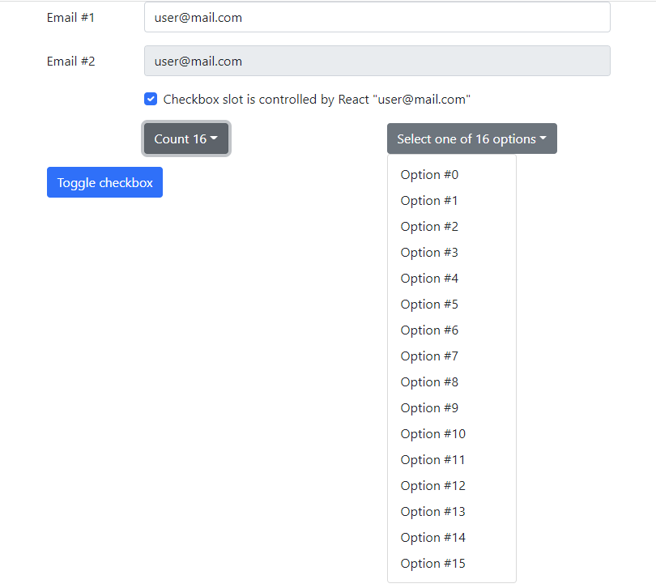

# Web Components PoC

Framework agnostic UI kit example based on [Web Components](https://developer.mozilla.org/ru/docs/Web/Web_Components)



## How to Start

1. `$ npm i`
2. `$ npm start`

## Standards and Libraries

1. [Autonomous Custom Elements](https://developer.mozilla.org/ru/docs/Web/Web_Components/Using_custom_elements)
2. *NO* Shadow DOM but [Slots](https://developer.mozilla.org/en-US/docs/Web/Web_Components/Using_templates_and_slots#adding_flexibility_with_slots) approach is implemented
3. [Preact](https://preactjs.com/guide/v10/web-components/#app) as a reactive template engine
4. [HTM](https://github.com/developit/htm) - temporal dependency; should be replaced with corresponding TS/Babel config

## Code Structure

Utils:

1. `src/utils/define.js` - helper to simplify declaration of custom elements
    * embeds *Preact* into custom element life cycle as a template engine
    * implements *Slots* approach
2. `src/utils/reactWrapper.js` - *Web Component* => *React Component* adapter
3. `src/utils/html.js` - wrapper for temporal dependency *HTM*

Web Components:

1. `src/Button` - `rshb-button`
2. `src/Checkbox` - `rshb-checkbox`
3. `src/Dropdown` - `rshb-dropdown`
4. `src/Input` - `rshb-input`

Form example: `App.js`

## Web Component Definition

```js
import { define } from "../utils/define";
import { html } from "../utils/html";
import "./Checkbox.css";

export const Checkbox = define(
  class extends HTMLElement {
    // Custom element tag name
    static tag = "rshb-checkbox";

    /**
     * Custom element attributes definition
     * 
     * type AttrName = string;
     * type AttrConverter<PropType = any> =(attrValue: string) => PropType;
     * type AttrsDefinition = Record<AttrName, AttrConverter>;
     */
    static props = {
      id: String,
      name: String,
      checked: Boolean,
      disabled: Boolean
    };

    /**
     * Custom element slots definition
     * 
     * type SlotName = string;
     * type SlotCSSSelector = string;
     * type SlotsDefinition = Record<SlotName, SlotCSSSelector>;
     */
    static slots = {
      label: "label"
    };

    static events = {
      onClick: "click"
    };

    // Preact component used as a template (hooks could be used here to introduce some logic)
    static template = (props) => (
      html`<div class="form-check">
        <input class="form-check-input" type="checkbox" ...${props} />
        <label for=${props.id} class="form-check-label" />
      </div>`
    );
  }
);
```

https://developer.mozilla.org/ru/docs/Web/CSS/:defined

```css
rshb-checkbox {
  display: inline;
}

rshb-checkbox:defined {
  opacity: 1;
}

rshb-checkbox:not(:defined) {
  opacity: 0.5;
}
```
